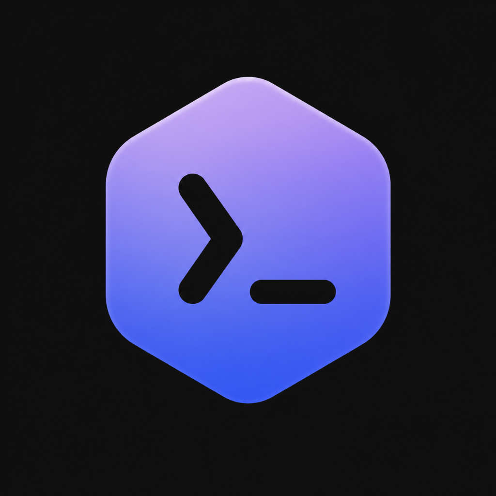
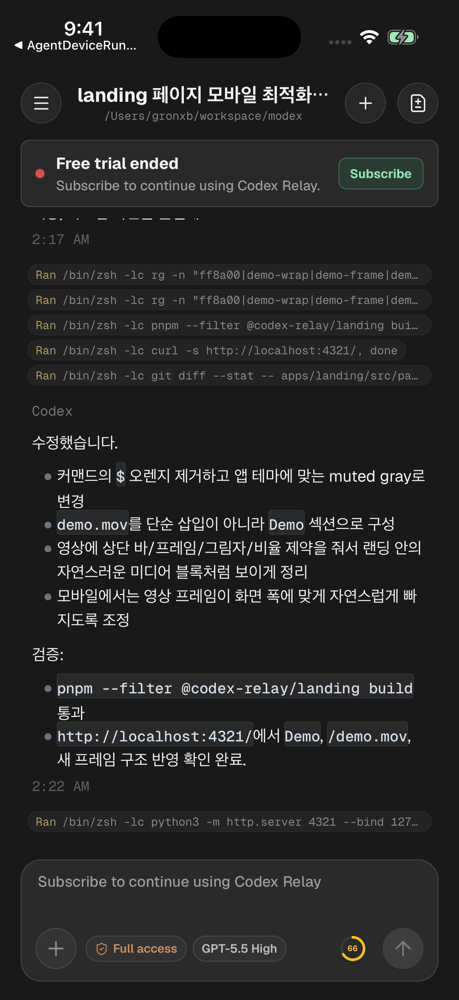
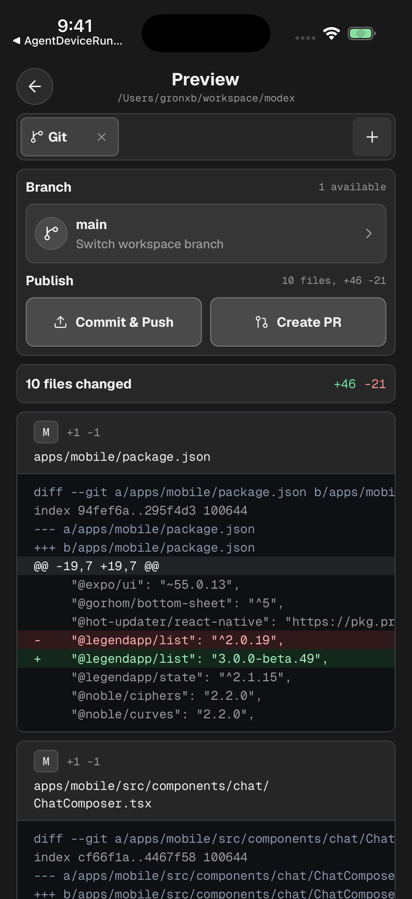
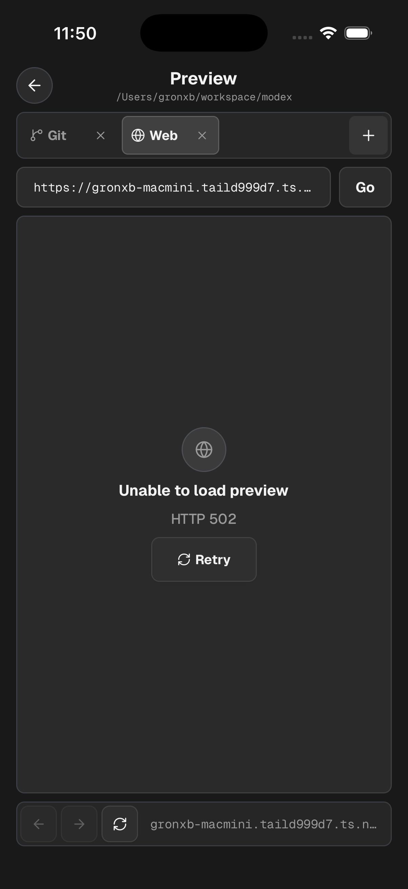
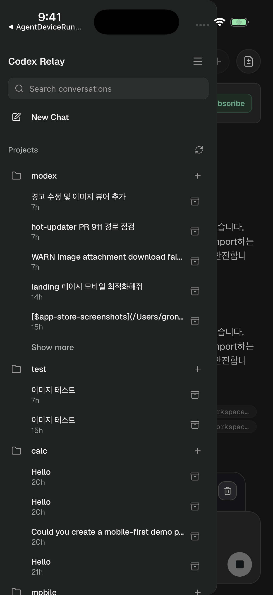

# Codex Relay

<p align="center">
  
</p>

<p align="center">
  <strong>Use Codex from your phone while the real work stays on your computer.</strong>
</p>

<p align="center">
  <a href="https://apps.apple.com/kr/app/codex-relay/id6764463488">
    
  </a>
</p>

<p align="center">
  <a href="https://www.npmjs.com/package/codex-relay"></a>
  <a href="https://apps.apple.com/kr/app/codex-relay/id6764463488"></a>
  
  
  
</p>

Codex Relay is a mobile companion for the Codex CLI. It runs a local relay
server in your workspace, pairs with the mobile app over your own network, and
lets you follow or steer Codex sessions from your phone.

The project is intentionally local-first. Your code, shell, git state, and
Codex CLI session stay on your computer; the phone talks to the relay that you
run.

<p align="center">
  
  
  
  
</p>

## What It Does

- Stream Codex output from a local workspace to a paired mobile app.
- Send prompts, continue threads, and respond when Codex needs input.
- Review active threads, queued inputs, approvals, and workspace state.
- Preview git changes, local web output, files, and terminal surfaces from
  mobile.
- Keep pairing and session data under your local relay state.

## Quick Start

### Requirements

- Node.js 22.14 or newer
- Codex CLI installed and signed in
- [Codex Relay on your phone](https://apps.apple.com/kr/app/codex-relay/id6764463488)
- A network path from your phone to your computer

### 1. Start the relay

From the workspace where you want Codex to work:

```sh
npx codex-relay@latest
```

The relay prints a QR code, a mobile URL, and a `codex-relay://pair...` pairing
link.

### 2. Pair the app

Open the mobile app and scan the QR code printed by the relay. If scanning is
not available, paste the full `codex-relay://pair...` link into the app.

When the app shows an approval code, approve it from your computer:

```sh
npx codex-relay@latest approve XXXX-XXXX
```

Your phone can now talk to your local Codex session.

## Network Setup

Your phone must be able to open the `Mobile:` URL printed by Codex Relay.

- Same Wi-Fi usually works.
- Tailscale is a good default when the devices are on different networks.
- If the printed URL is not reachable from your phone, set
  `CODEX_RELAY_PUBLIC_URL` to a reachable LAN, Tailscale, or tunnel URL.

Example:

```sh
CODEX_RELAY_PUBLIC_URL=http://<computer-ip>:8787 npx codex-relay@latest
```

## Common Commands

| Command                                    | What it does                                        |
| ------------------------------------------ | --------------------------------------------------- |
| `npx codex-relay@latest`                   | Start the relay and print a pairing QR.             |
| `npx codex-relay@latest --bg`              | Keep the relay running in the background.           |
| `npx codex-relay@latest qr`                | Print the current pairing QR for an existing relay. |
| `npx codex-relay@latest approve XXXX-XXXX` | Approve a pending mobile pairing request.           |
| `npx codex-relay@latest clear`             | Sign out every paired mobile app.                   |

## Configuration

The relay listens on `0.0.0.0:8787` by default.

| Variable                     | Purpose                                                             |
| ---------------------------- | ------------------------------------------------------------------- |
| `PORT`                       | Server port. Defaults to `8787`.                                    |
| `HOST`                       | Listen host. Defaults to `0.0.0.0`.                                 |
| `CODEX_RELAY_PUBLIC_URL`     | URL printed into the pairing QR, such as a Tailscale or tunnel URL. |
| `CODEX_RELAY_WORKSPACE_PATH` | Workspace path Codex should use. Defaults to the current directory. |
| `CODEX_RELAY_AUTH_DB_PATH`   | Pairing and session database path.                                  |
| `CODEX_BIN`                  | Codex CLI executable path.                                          |
| `CODEX_HOME`                 | Codex home directory for reading local session metadata.            |

Background mode writes runtime files under `.codex-relay/` in the current
workspace, including server logs, process state, and pairing data.

## Troubleshooting

If `qr` cannot find a server, start one first:

```sh
npx codex-relay@latest
```

If another process is using the local pairing database, use the existing server:

```sh
npx codex-relay@latest qr
```

If the mobile app cannot connect, confirm that the phone can reach the printed
`Mobile:` URL and that your firewall allows traffic on the relay port.

## License

Codex Relay is licensed under the Apache License 2.0. See [LICENSE](./LICENSE).

The Codex Relay name, logos, app icons, screenshots, and other brand assets are
not licensed under Apache-2.0. See [TRADEMARKS.md](./TRADEMARKS.md).
